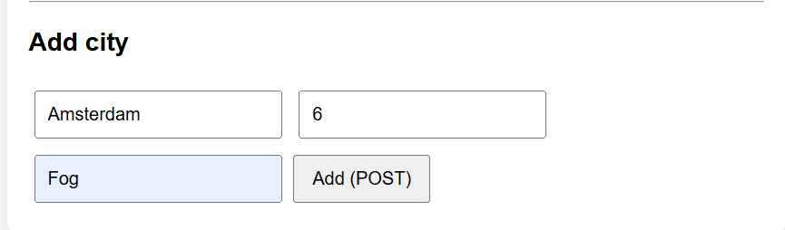
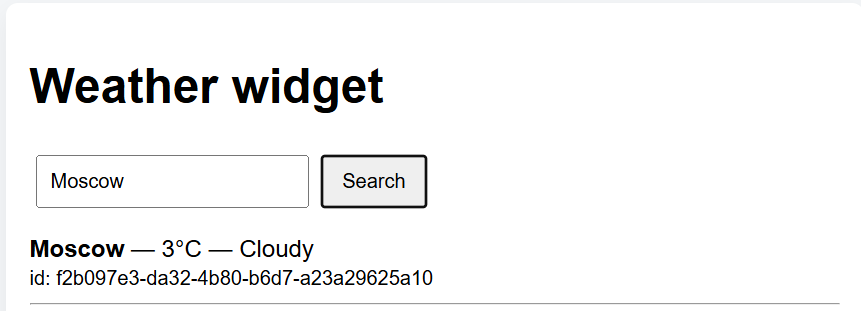
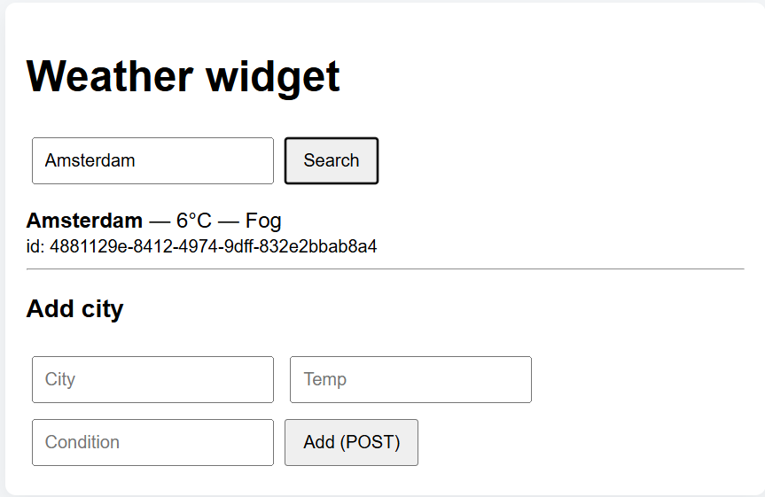
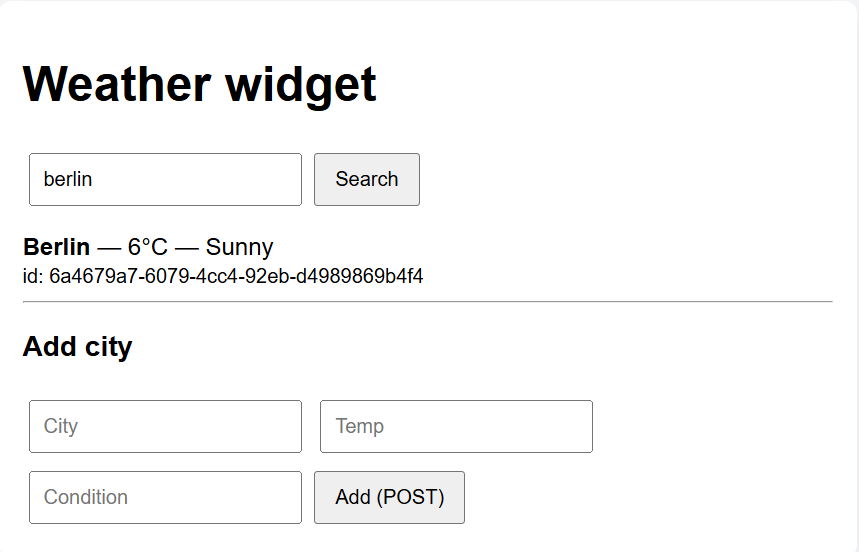

Простой погодный виджет

http://localhost:3000

# Функционал
- GET /api/weather — получить список прогнозов; поддерживает query: `city`, `minTemp`, `maxTemp`, `limit`.
- GET /api/weather/:id — получить запись по id (параметры через `req.params`).
- POST /api/weather — создать запись (требуется x-api-key header или ?apiKey=).
- PUT /api/weather/:id — обновить запись (требуется ключ).
- DELETE /api/weather/:id — удалить запись (требуется ключ).
- Static files served from `/public` (виджет).
- Собственный middleware `middleware/logger.js`.
- Структура: `routes/` + `controllers/`.

 - добавить новый город

 - пример 1

 - пример 2

 - пример 3